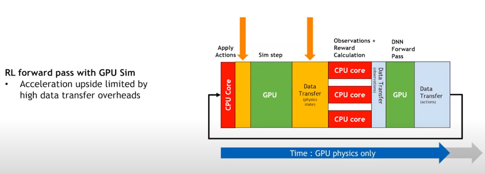
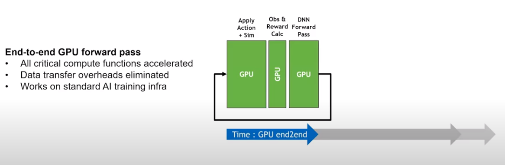

# Waymax-RL

> **End-to-End GPU Reinforcement Learning for Waymax Autonomous Driving Simulation**

---

## Overview

**waymax-RL** is an **all-GPU reinforcement learning training framework** developed for **Waymax** (GPU-based autonomous driving simulation).

- **GPU-based autonomous driving RL**, far surpassing traditional RL frameworks
- Supports **direct execution on Colab**  
- Built on **DLPack**, enabling direct GPU memory exchange between simulation and deep learning frameworks, compatible with **PyTorch, Paddle, TensorFlow, JAX**  
- Currently provides a **PyTorch-based training workflow**  
- Internal versions of Waymax-RL have already been **tested on real vehicles**, demonstrating the efficiency of large-scale RL training

👉 **Try it online**: Run the Colab example [[Colab Example]](https://colab.research.google.com/drive/1l7TxIeM8Qd-THscwMoTcJS1Dfz8TeT5u?usp=sharing)

---

## Table of Contents

- [Waymax-RL](#waymax-rl)
  - [Overview](#overview)
  - [Table of Contents](#table-of-contents)
  - [What is Waymax?](#what-is-waymax)
  - [Why Open-source waymax-RL?](#why-open-source-waymax-rl)
  - [Installation (Local)](#installation-local)
  - [Quick Start](#quick-start)
    - [Training Example](#training-example)
  - [Support](#support)

---

## What is Waymax?

[**Waymax**](https://github.com/waymo-research/waymax) is a **fully GPU-powered structured autonomous driving simulation engine** jointly launched by Waymo and DeepMind at the end of 2023.  

By moving the simulation logic entirely to the GPU, it can achieve **over ten thousand times real-time speed** in parallel simulation and data generation, opening new possibilities for large-scale RL training.  

Following Waymax, Apple released related research such as **GIGAFLOW** in 2025, demonstrating state-of-the-art capabilities in autonomous driving using purely simulated data and large-scale GPU RL training.

---

## Why Open-source waymax-RL?

- While Waymax officially open-sourced the GPU simulator, **the fully GPU RL training framework was not released**, see [issue](https://github.com/waymo-research/waymax/issues/11)  
- Simply replacing the simulator with GPU-driven Waymax, but continuing to use **traditional CPU-based distributed RL frameworks** like rllib or parl, **cannot achieve ten-thousand-fold real-time efficiency**. CPU ↔ GPU data transfer becomes the new bottleneck (see Figure a). Although sim steps are GPU-parallelized, a large part of RL operations remain on the CPU.  



Only when combined with a fully GPU RL training framework can the GPU simulator reach its maximum efficiency, as shown in Figure b.



> ⚠️ Note: Figures a and b are screenshots from the official NVIDIA Isaac Gym overview video  
> [Isaac Gym Overview](https://youtu.be/nleDq-oJjGk?si=9I0fKCklk3c6QFTS).  
> Used for academic/demo purposes only. Copyright belongs to NVIDIA.

- In robotics, all-GPU RL training has already brought significant breakthroughs using GPU simulation (e.g., Isaac Sim) combined with GPU training frameworks (e.g., Isaac Lab, rl-games). By learning from these, we hope that open-sourcing Waymax-RL can promote all-GPU RL research in autonomous driving.

Thus, we open-source **waymax-RL**, providing a tightly integrated RL training framework for GPU simulation, helping researchers and engineers efficiently train autonomous driving agents on GPUs.

---

## Installation (Local)

Similar to Colab, the local installation steps are:

```bash
# 1. Create conda environment
conda create -n waymax_rl python=3.10

# 2. Install jax (CUDA 12)
pip install -U "jax[cuda12]"

# 3. Clone Waymax
git clone https://github.com/waymo-research/waymax.git

# 4. Install specific Waymax version
cd waymax
git checkout 71c2be9
pip install -e .

# 5. Uninstall GPU TensorFlow (to avoid conflicts)
pip uninstall -y tensorflow

# 6. Install waymax-RL
cd ../waymax_rl
pip install -r requirements.txt
```

---

## Quick Start

### Training Example

```bash
cd waymax_rl
python train.py --config-name=ppo_config
```

---

## Support

If you find this research useful, please ⭐️ support us!  

---
